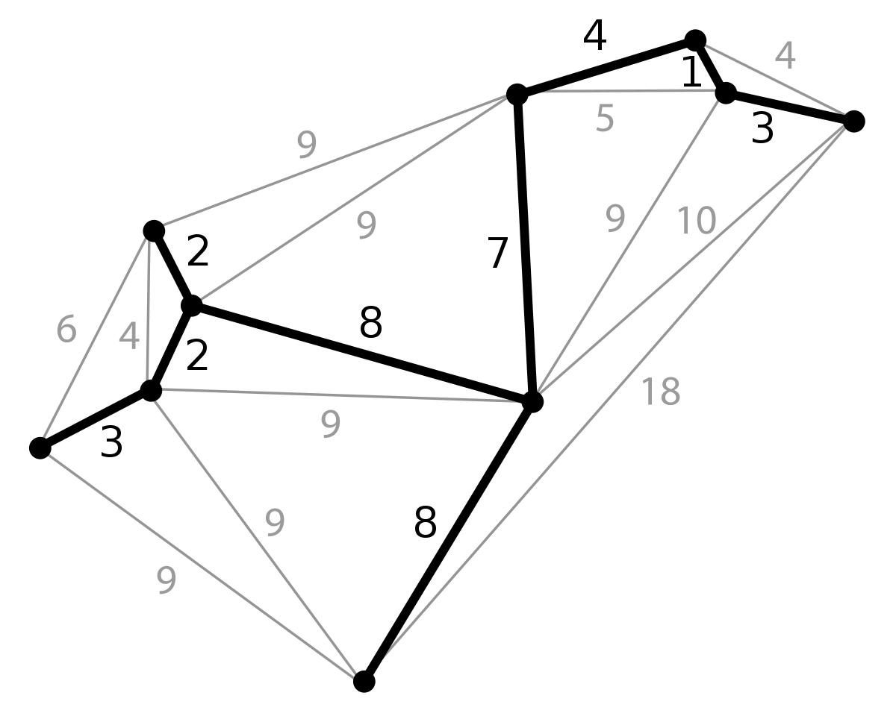
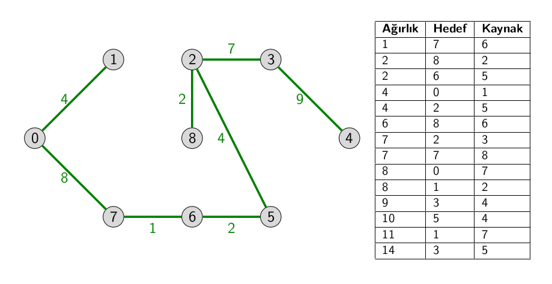

## Minimum Spanning Trees

Kapsayan ağaçlar bağlı ve yönsüz bir çizgede bütün düğümleri birbirine bağlayan ağaç yapısındaki bir alt çizgedir. Minimum kapsayan ağaç(minimum spanning tree, MST) kapsayan ağaçlar içinde toplam ağırlığı en az olan ağaçtır.

Minimum kapsayan ağaç V − 1 tane kenar içerir.

 
	

#### Kurskal's MST algorithm

- Edge'leri ağırlıklara göre sırala  
- Eğer seçilen edge çizildiğinde döngü oluşmuyor ise çizimi yap
- V-1 tane olasaya kadar adım 2'yi tekrarla

 
	

 
	

#### Prim's MST algorithm

Bir yer seçilir. Döngü olmayacak şekilde küçükler ekleye ekleye gidilir.

Anlatması zor, aşağıdaki videoda güzel açıklanmış:

<a href="https://www.youtube.com/watch?v=cplfcGZmX7I ">https://www.youtube.com/watch?v=cplfcGZmX7I</a>

#### Dijkstra's algorithm

<a href="https://www.youtube.com/watch?v=jT3c45XkPTg">https://www.youtube.com/watch?v=jT3c45XkPTg</a>

<a href="https://www.youtube.com/watch?v=eVV6p0axFYc">https://www.youtube.com/watch?v=eVV6p0axFYc</a>

