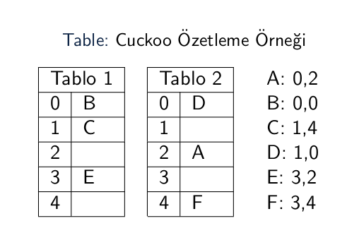

## HASH (özetleme fonksiyonları)

Hashing, sabit boyutlo bir tabloya veriyi izdüşürme işlemidir. Bu işlem ile arama ve ekleme işlemlerini sabit zamana çekmek amaçlanır. Ayrıca kriptoloji için geridönülemeyecek hashing'ler uygulanır. Yani veri bir fonksiyondan geçirilerir.

Örneğin f(x) = x mod 13 fonksiyonu doğal sayıları 13 uzunluklu bir tabloya izdüşürür

#### Seperated Chain Hashing (ayrık zincirleme)

Veri fonksiyondan geçirildikten sonra tabloda ilgili yere yerleştirilir. Aynı yere denk gelen verileri saklamak amacıyla linked list kullanılır. Linked list kullanmak oldukça maliyetlidir.

```java
LinkedList<Integer>[] array;

public SperatedChainHash(int value) {
	array = new LinkedList[value];
}

public void add(int value) {
	int location = value % array.length;

	if(array[location] == null) {
		LinkedList<Integer> toAdd = new LinkedList<Integer>();
		toAdd.add(value);
		array[location] = toAdd; 
	} else {
		array[location].add(value);
	}
}

public boolean remove(int value){
	int location = value % array.length;

	if(array[location] == null) {
		return false;
	} else {
		if(array[location].contains(value)) {
			int linkedListLocation = dizi[location].indexOf(value);
			dizi[location].remove(linkedListLocation);

			return true;
		} else {
			return false;
		}
	}
}
```
#### Linear Probe Hashing (doğrusal sondalama)

SperatedChainHash'de Linked List oluşturma belli bir zaman alacağı için performanssız olabilir. Linear Probe Hash'de yalnızca düz bir liste olur ve verileri fonksiyondan geçirildikten sorna yerine konulur.

Eğer aynı konuma birden fazla veri denk düşüyor ise, veri listede birer birer atlanarak konulmaya çalışılır.

#### Quadric Probe Hashing (karesel sondalama)

Linear Probe Hash'in aynısıdır. Yalnızca veriler konulurken uygulanan adım sayısının karesi kadar uzaklığa konulmaya çalışılır.

Eğer tablo çok şişerse yeniden özetleme yapılarak daha büyük bir tabloya (en az iki katı boyunda) geçiş yapılır.

```java
public class HashEntry<T> {

	T value;
	boolean isActive;

	public HashEntry(T value, boolean isActive) {
		this.value = value;
		this.isActive = isActive;
	}

	public HashEntry(T value) {
		this(value, true);
	}
}
```

```java
HashEntry[] array;

public SperatedChainHash(int value) {
	array = new HashEntry[value];
}

public void add(int value) {
	int counter = 0;
	int location = value.hashCode() % array.length;

	while(true) {
		int arrayLocation = (location + counter * counter) % array.length;

		if(array[arrayLocation] == null && ! array[arrayLocation].isActive) {
			array[arrayLocation] = new HashEntry(value);
			break;
		} else {
			counter++;
		}
	}
}

public boolean remove(int value){
	int counter = 0;
	int location = value.hashCode() % array.length;

	while(true) {
		int arrayLocation = (location + counter * counter) % array.length;

		if(array[arrayLocation].value.equals(value) && dizi[arrayLocation].isActive) {
			array[arrayLocation].isActive = false;
			return true;
		} else {
			counter++;
		}
	}
}
```

#### Double Hashing

İki tablo bulunur, çakışma olaması durumunda veri ikinci tabloya eklenir.

hash1(x) = x % a  
hash2(x) = (b - x) % b

gibi..

#### Cuckoo Hashing

Yarısı boş kalacak şekilde iki tane hashing tablosu bulunur. Veriler bu iki tablodan birinde bulunur.

<p align="center"> 
	
</p>

<p align="center">
	
</p>

<p align="center"><a href="https://www.youtube.com/watch?v=tiYcWJPtcs4">https://www.youtube.com/watch?v=tiYcWJPtcs4</a></p>

#### Hopscotch Hashing

Linear Probe Hashing'i daha gelişmiş hala getirmek amacıyla ortaya çıkmıştır. Amaç daha kısa sürede probe(sondalama) işleminin yapılmasını sağlamaktır.

MAX_DIST kavramı ile bir eleman özgün konumunundan en fazla ne kadar uzakta yer alabilir bu belirtilir.

Eğer eleman MAX_DIST'ten daha uzakta ise, geriye doğru giderek uygun bir değer ile yer değiştirilir.

HOP bilgisinde, o anki hashing değerine devam eden bilgilerden hangilerinin dahil olduğu bit olarak ifade eder.

Örneğin MAX_DIST=4 için 5. konumdaki hashing için HOP değeri 1011 ise 5,7 ve 8. konumdaki elemanların hashing değerinin 5 olduğunu anlarız.

<p align="center">
	
</p>
