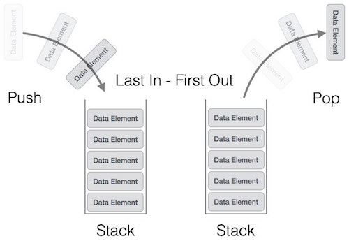
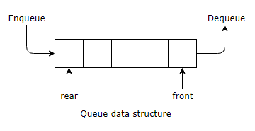

## Stacks (yığıtlar)

<p align="center"> 
	
</p>

**Last in, First out** mantığı ile çalışır. Üst üste dizilen tabaklar gibi düşünülebilir.

Stack soyut bir veritipidir. (SVT)

SVT'ler add, remove, size, contains, union, find gibi işlemler içerir.

Stack farklı veri yapıları kullanılarak gerçekleştirilebilir (implementation) . **`array, linkedlist, ..`**

**`push()`** -> ekleme  
**`pop()`** -> çıkarma

## Queues (kuyruklar)

<p align="center"> 
	
</p>

**First in, First out** mantığı ile çalışır.

**`enqueue()`** -> ekleme  
**`dequeue()`** -> çıkarma

Başlangıçta **`front`** ve **`rear`** -1 olur. Ekleme yapıldığında rear artar, çıkarma yapıldığında front artar.

İlk değer eklendiğinde, iki değerde 0 olarak ayarlanır.

**`[5]`**  -> front -> rear  
**`[ ]`**  
**`[ ]`**

Yeni bir değer eklendiğinde rear artar

**`[5]`**  -> front  
**`[6]`**  -> rear  
**`[ ]`**

Bir değer silindiğinde front artar

**`[5]`**  
**`[6]`**  -> front -> rear   
**`[ ]`**

Eğer front > rear olursa Queue boşalmıştır demektir, sıfırlanır. (front = rear = -1)

**`[5]`**  
**`[6]`**  -> rear   
**`[ ]`**  -> front

## Operation Notations (işlem notasyonları)

**`infix`** = value_1 + operator + value_2

**`prefix`** = operator + value_1 + value_2

**`postfix`** = value_1 + value_2 + operator

**Örnek :**

4 x 4 + 4 x 4 + 4 - 4 x 4, olarak gelen infix ifadesini postfix olarak gösterin.

postfix = 4 4 * 4 4 * + 4 4 * -

**Örnek :**

3 * 2 + 4 - 7 / 5, olarak gelen infix ifadesini postfix olarak gösterin.

postfix = 3 2 * 4 + 7 5 / -

## Postfix değerlendirme algoritması

```java
public static int postfixResult(String input) {
	Stack<Integer> values = new Stack<>();

	for(element : input.split(" ")) {
		if(Character.isDigit(element.charAt(0))) {
			values.push(element);
		} else {
			value_2 = values.pop();
			value_1 = values.pop();

			values.push(makeOperation(element, value_1, value_2));
		}
	}

	return values.pop();
}
```
